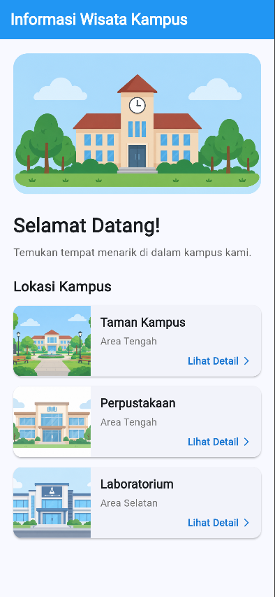
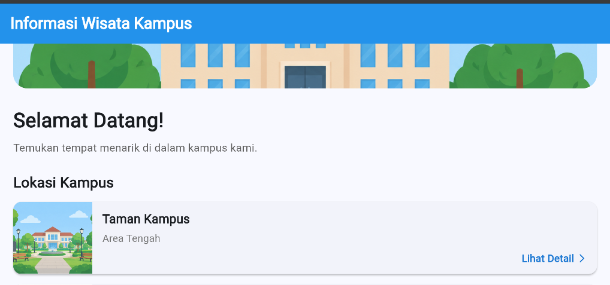
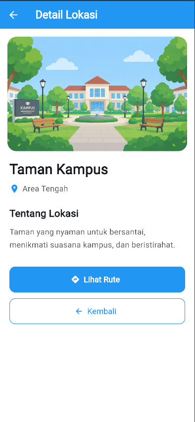
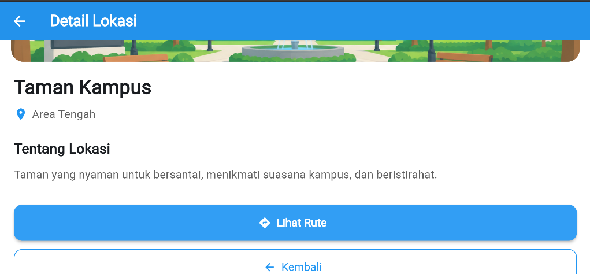
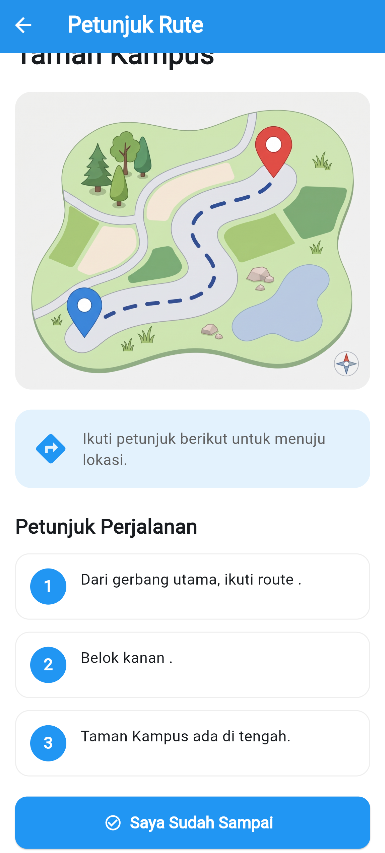
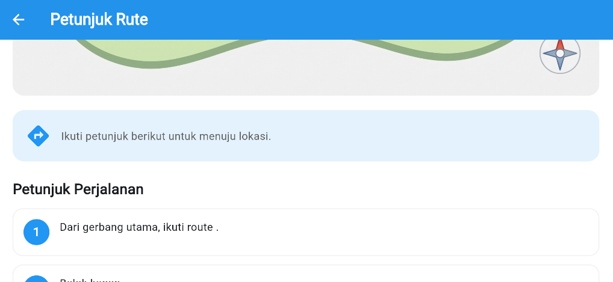
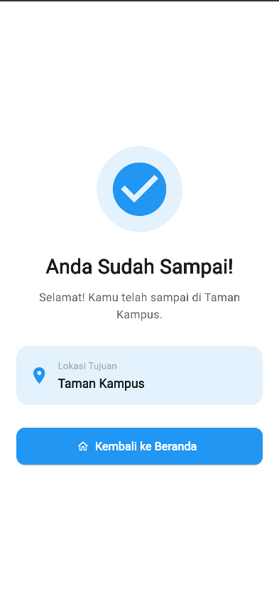

# Laporan Praktikum: Informasi Wisata Kampus

- **Nama**: Yudista Aprilio Rami Firmansyah
- **NIM**: 362558302045
- **Kelas / Prodi**: 2C / Sarjana Terapan TRPL
- **Mata Kuliah**: Pemrograman Perangkat Bergerak (Semester 3)

---

## 1. Ringkasan Aktivitas

Pada praktikum ini, saya membuat aplikasi **Informasi Wisata Kampus** menggunakan Flutter dan bahasa pemrograman Dart. Aplikasi ini dibuat untuk menampilkan beberapa lokasi yang terdapat di lingkungan kampus serta memberikan informasi dan petunjuk rute menuju lokasi tersebut.

Aplikasi memiliki beberapa halaman utama, yaitu halaman **Home**, **Detail Lokasi**, **Petunjuk Rute**, dan **Halaman Berhasil** setelah pengguna sampai di lokasi tujuan.

Lokasi yang ditampilkan dalam aplikasi terdiri dari **Taman Kampus, Perpustakaan, dan Laboratorium**. Setiap lokasi memiliki gambar, informasi lokasi, serta petunjuk perjalanan yang dapat digunakan oleh pengguna.

Selain membuat fungsi utama aplikasi, saya juga melakukan pengujian tampilan dalam mode **portrait dan landscape** serta menjalankan aplikasi melalui Google Chrome untuk memastikan tampilan dapat menyesuaikan ukuran layar.

---

## 2. Fitur dan Alur Aplikasi

Aplikasi Informasi Wisata Kampus memiliki beberapa fitur utama, yaitu:

- Menampilkan halaman utama aplikasi.
- Menampilkan daftar lokasi kampus.
- Menampilkan gambar setiap lokasi.
- Menampilkan detail informasi lokasi.
- Menampilkan gambar rute menuju lokasi.
- Menampilkan petunjuk perjalanan.
- Menampilkan konfirmasi setelah sampai di lokasi.
- Navigasi antar halaman menggunakan `Navigator`.
- Mendukung tampilan portrait dan landscape.

### Alur Aplikasi

```text
Home
  ↓
Detail Lokasi
  ↓
Petunjuk Rute
  ↓
"Saya Sudah Sampai"
  ↓
Halaman Berhasil
  ↓
Kembali ke Beranda
```

---

## 3. Struktur Project

Struktur project yang digunakan dalam aplikasi adalah sebagai berikut:

```text
wisata_kampus/
│
├── app_screenshots/
│   └── wisata_kampus/
│       ├── home-p.png
│       ├── home-l.png
│       ├── detail-p.png
│       ├── detail-l.png
│       ├── route-p.png
│       ├── route-l.png
│       └── succes.png
│
├── assets/
│   └── images/
│       ├── home.png
│       ├── taman.png
│       ├── perpustakaan.png
│       ├── lab.png
│       └── route.jpg
│
├── lib/
│   └── wisata_kampus/
│       ├── models/
│       │   └── campus_location.dart
│       │
│       ├── pages/
│       │   ├── detail_page.dart
│       │   ├── route_page.dart
│       │   └── success_page.dart
│       │
│       ├── widgets/
│       │
│       └── main.dart
│
├── pubspec.yaml
└── README.md
```

---

## 4. Tampilan Aplikasi

### 4.1 Halaman Home

Halaman Home merupakan halaman awal aplikasi yang menampilkan gambar utama, informasi singkat, serta daftar lokasi yang tersedia di lingkungan kampus.

| Mode Portrait | Mode Landscape |
|---|---|
|  |  |

---

### 4.2 Halaman Detail Lokasi

Halaman Detail Lokasi menampilkan gambar lokasi yang dipilih, nama lokasi, area, deskripsi, serta tombol untuk melihat rute menuju lokasi.

| Mode Portrait | Mode Landscape |
|---|---|
|  |  |

---

### 4.3 Halaman Petunjuk Rute

Halaman Petunjuk Rute menampilkan gambar rute serta beberapa langkah petunjuk perjalanan menuju lokasi yang dipilih.

| Mode Portrait | Mode Landscape |
|---|---|
|  |  |

---

### 4.4 Halaman Berhasil

Halaman Berhasil ditampilkan setelah pengguna menekan tombol **"Saya Sudah Sampai"**. Halaman ini memberikan informasi bahwa pengguna telah sampai di lokasi tujuan.



---

## 5. Teknologi yang Digunakan

Teknologi yang digunakan dalam pembuatan aplikasi ini yaitu:

- **Flutter** sebagai framework pengembangan aplikasi.
- **Dart** sebagai bahasa pemrograman.
- **Material Design** untuk komponen dan tampilan antarmuka.
- **Navigator** untuk perpindahan antar halaman.
- **Responsive Layout** untuk menyesuaikan tampilan berdasarkan ukuran dan orientasi layar.
- **VS Code** sebagai code editor.

---

## 6. Implementasi Navigasi

Navigasi pada aplikasi menggunakan `Navigator` bawaan Flutter. Alur perpindahan halaman dibuat secara berurutan agar pengguna dapat melihat informasi lokasi hingga mendapatkan konfirmasi setelah sampai.

Implementasi navigasi yang digunakan yaitu:

- `Navigator.push()` untuk berpindah dari Home ke Detail Lokasi.
- `Navigator.push()` untuk berpindah dari Detail Lokasi ke Petunjuk Rute.
- `Navigator.pushReplacement()` untuk berpindah dari Petunjuk Rute ke Halaman Berhasil.
- `Navigator.pop()` untuk kembali ke halaman sebelumnya atau beranda.

---

## 7. Kendala yang Dihadapi & Solusinya

### Kendala 1 — Ukuran Gambar Rute

Pada saat pengembangan aplikasi, gambar rute sempat tampil terlalu besar secara vertikal ketika dijalankan pada layar desktop.

**Solusi:** Saya melakukan pengaturan ukuran dan batas lebar gambar menggunakan `ConstrainedBox` serta menyesuaikan `BoxFit` agar gambar tetap terlihat proporsional.

### Kendala 2 — Pemanggilan Asset

Pada awal pengembangan terdapat penyesuaian pada konfigurasi asset agar seluruh gambar dapat digunakan di dalam aplikasi.

**Solusi:** Saya mengatur bagian `assets` pada `pubspec.yaml` dengan direktori:

```yaml
flutter:
  assets:
    - assets/images/
```

Kemudian menjalankan kembali:

```bash
flutter pub get
```

### Kendala 3 — Tampilan pada Layar Desktop

Ukuran layar desktop lebih lebar dibandingkan tampilan mobile sehingga beberapa komponen perlu dibatasi agar tidak terlalu melebar.

**Solusi:** Saya menggunakan pembatas lebar pada beberapa bagian halaman sehingga tampilan tetap nyaman digunakan pada ukuran layar yang berbeda.

---

## 8. Kesimpulan

Berdasarkan praktikum yang telah dilakukan, aplikasi **Informasi Wisata Kampus** berhasil dibuat menggunakan Flutter dan Dart.

Aplikasi dapat menampilkan beberapa lokasi kampus beserta informasi, gambar, rute, dan petunjuk perjalanan. Navigasi antar halaman juga dapat berjalan sesuai alur yang telah dirancang.

Aplikasi telah diuji dalam mode **portrait dan landscape** serta dapat dijalankan melalui Google Chrome. Tampilan aplikasi juga telah disesuaikan agar tetap proporsional pada ukuran layar yang berbeda.

Dengan dibuatnya aplikasi ini, saya dapat menerapkan penggunaan Flutter, Dart, asset gambar, model data, navigasi antar halaman, serta penyesuaian tampilan responsive dalam satu project.